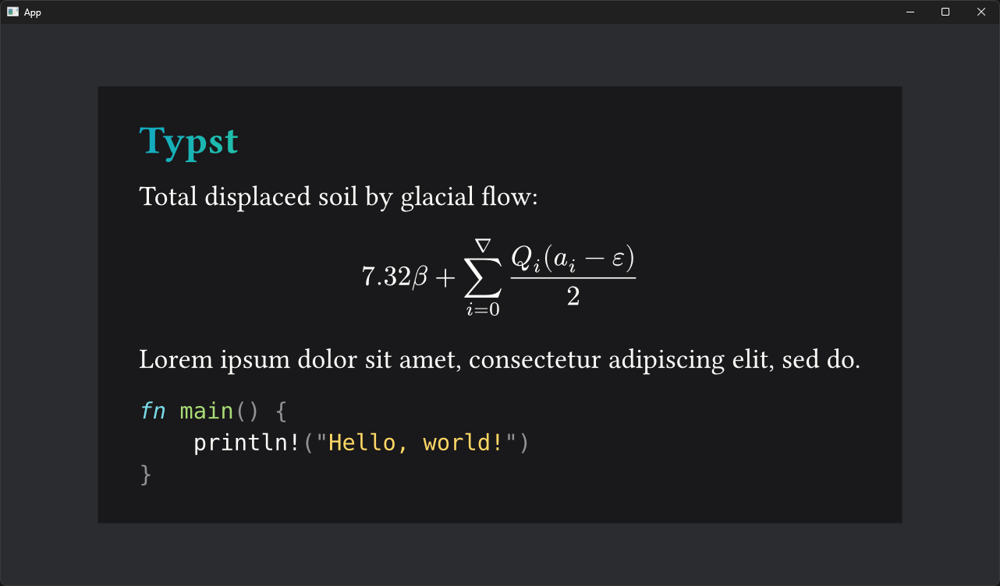

# Bevy Typst

A [Typst](https://typst.app) integration for [Bevy](https://bevyengine.org). Bevy Typst supports compiling raw Typst text into a SVG tree, which can then be used to generate [Vello](https://github.com/linebender/vello) scenes for rendering in Bevy.

*Associated example [here](./examples/hello_world.rs)!*

## Join the community!

You can join us on the [Voxell discord server](https://discord.gg/WDBnuNH).

## License

`bevy_typst` is dual-licensed under either:

- MIT License ([LICENSE-MIT](LICENSE-MIT) or [http://opensource.org/licenses/MIT](http://opensource.org/licenses/MIT))
- Apache License, Version 2.0 ([LICENSE-APACHE](LICENSE-APACHE) or [http://www.apache.org/licenses/LICENSE-2.0](http://www.apache.org/licenses/LICENSE-2.0))

This means you can select the license you prefer!
This dual-licensing approach is the de-facto standard in the Rust ecosystem and there are [very good reasons](https://github.com/bevyengine/bevy/issues/2373) to include both.
