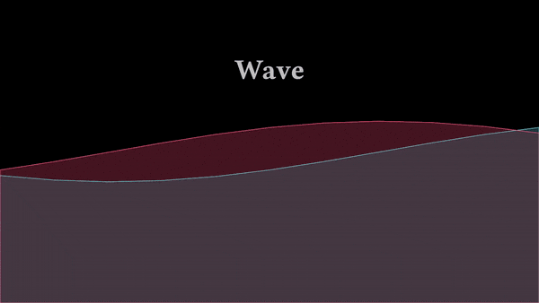
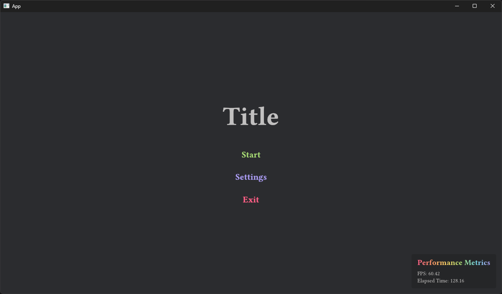

# Velyst

Interactive [Typst](https://typst.app) content creator using [Vello](https://github.com/linebender/vello) and [Bevy](https://bevyengine.org).



*Associated example [here](./examples/hello_world.rs)!*

## Quickstart

Velyst renders Typst content using Typst functions.
This example shows you how to render a simple white box in the center of the screen.
To get started rendering a simple box, create a function inside a `.typ` file:

```typ
#let main() = {
  box(width: 100%, height: 100%)[
    #place(center + horizon)[
      #box(width: 10em, height: 10em, fill: white)
    ]
  ]
}
```

Then, in your `.rs` file, load your Typst asset file and register your function.

```rs
use bevy::prelude::*;
use bevy_vello::prelude::*;
use velyst::prelude::*;

fn main() {
    App::new()
        .add_plugins((
            DefaultPlugins,
            bevy_vello::VelloPlugin::default(),
            velyst::VelystPlugin,
        ))
        .register_typst_func::<MainFunc>()
        .add_systems(Startup, setup)
        .run();
}

fn setup(mut commands: Commands, asset_server: Res<AssetServer>) {
    commands.spawn((Camera2d, VelloView));

    let handle =
        VelystSourceHandle(asset_server.load("typst/box.typ"));

    commands.spawn((
        VelystFuncBundle {
            handle,
            func: MainFunc::default(),
        },
        VelystSize {
            width: Val::Percent(100.0),
            height: Val::Percent(100.0),
        },
    ));
}

typst_func!(
    "main",
    #[derive(Component, Default)]
    struct MainFunc {},
);
```

## Interactions

Velyst is also compatible with `bevy_ui` interactions.



*Associated example [here](./examples/game_ui.rs)!*

## Join the community!

You can join us on the [Voxell discord server](https://discord.gg/Mhnyp6VYEQ).

## License

`velyst` is dual-licensed under either:

- MIT License ([LICENSE-MIT](LICENSE-MIT) or [http://opensource.org/licenses/MIT](http://opensource.org/licenses/MIT))
- Apache License, Version 2.0 ([LICENSE-APACHE](LICENSE-APACHE) or [http://www.apache.org/licenses/LICENSE-2.0](http://www.apache.org/licenses/LICENSE-2.0))

This means you can select the license you prefer!
This dual-licensing approach is the de-facto standard in the Rust ecosystem and there are [very good reasons](https://github.com/bevyengine/bevy/issues/2373) to include both.
