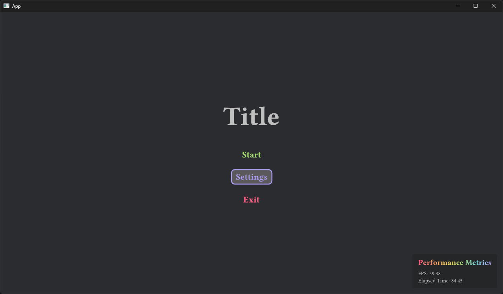

# Velyst

Interactive [Typst](https://typst.app) content creator using [Vello](https://github.com/linebender/vello) and [Bevy](https://bevyengine.org).


*Associated example [here](./examples/hello_world.rs)!*

## Quickstart

Velyst renders Typst content using Typst functions. To get started rendering a simple box, create a function inside a `.typ` file:

```typ
#let main(width, height) = {
  // Convert float to length
  let width = (width * 1pt)
  let height = (height * 1pt)

  box(width: width, height: height, fill: white)
}
```

Then, in your `.rs` file, register your Typst asset file and function.

```rs
use bevy::prelude::*;
use bevy_vello::VelloPlugin;
use velyst::{prelude::*, typst_element::prelude::*, VelystPlugin};

fn main() {
    App::new()
        .add_plugins((DefaultPlugins, VelloPlugin::default()))
        .add_plugins(VelystPlugin::default())
        .register_typst_asset::<HelloWorld>()
        .compile_typst_func::<HelloWorld, MainFunc>()
        .render_typst_func::<MainFunc>()
        .insert_resource(MainFunc {
            width: 100.0,
            height: 100.0,
        })
        .add_systems(Startup, setup)
        .run();
}

fn setup(mut commands: Commands) {
    commands.spawn(Camera2dBundle::default());
}

// `main` function in Typst with their respective values.
#[derive(TypstFunc, Resource, Default)]
#[typst_func(name = "main")] // name of function in the Typst file
struct MainFunc {
    width: f64,
    height: f64,
}

// Path to the Typst file that you created.
#[derive(TypstPath)]
#[typst_path = "path/to/file.typ"]
struct HelloWorld;
```

## Interactions

Velyst comes with built-in interactions using `bevy_ui`.



*Associated example [here](./examples/game_ui.rs)!*

## Join the community!

You can join us on the [Voxell discord server](https://discord.gg/Mhnyp6VYEQ).

## License

`velyst` is dual-licensed under either:

- MIT License ([LICENSE-MIT](LICENSE-MIT) or [http://opensource.org/licenses/MIT](http://opensource.org/licenses/MIT))
- Apache License, Version 2.0 ([LICENSE-APACHE](LICENSE-APACHE) or [http://www.apache.org/licenses/LICENSE-2.0](http://www.apache.org/licenses/LICENSE-2.0))

This means you can select the license you prefer!
This dual-licensing approach is the de-facto standard in the Rust ecosystem and there are [very good reasons](https://github.com/bevyengine/bevy/issues/2373) to include both.
